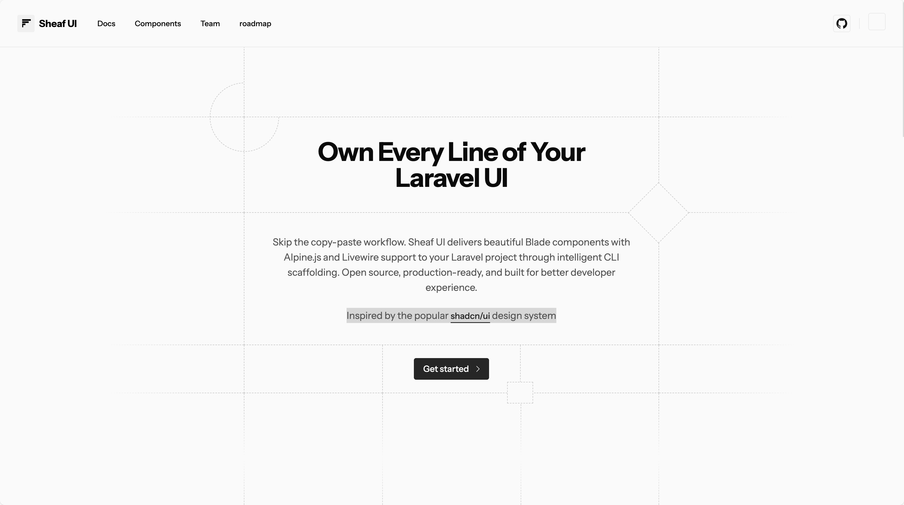

# Tool Dev

Di Bawah ini adalah list tools yang bagus untuk digunakan dalam pemrograman.

## Sheaf UI

site : [Sheaf UI](https://sheafui.dev/)

> Inspired by the popular shadcn/ui design system.

Mirip shadcn/ui tapi versi blade & livewire
